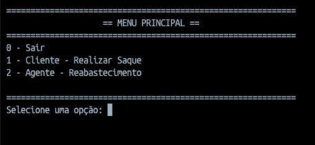
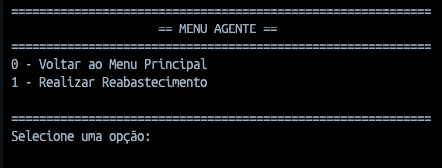
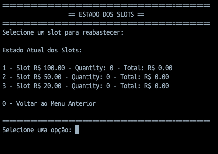
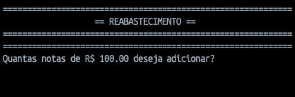
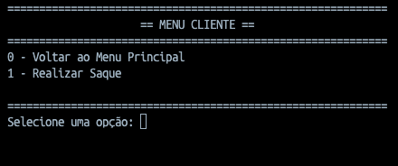
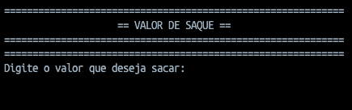
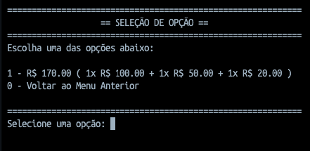

# 📋 Documentação da Solução: ATM Simulator

## 1. Visão Geral

O projeto **atm-simulator** é uma implementação de um simulador de caixa eletrônico que permite a realização de saques em três denominações de notas: R$ 20, R$ 50 e R$ 100.

A solução está estruturada em duas camadas principais:
- **Camada de Domínio** (`atm-executor/domain`): Lógica de negócio pura
- **Camada de Apresentação** (`atm-executor/consoleTemplate`): Interface com o usuário via terminal

Este documento concentra-se na **camada de domínio**, que implementa os conceitos principais do exercício.

---

## 2. Arquitetura da Camada de Domínio

A camada de domínio é composta por **4 classes principais** que trabalham em conjunto seguindo princípios SOLID e padrões de design reconhecidos:

### 2.1 Classes do Domínio

```
domain/
├── Money.cs                    # Value Object representando valores monetários
├── MoneySlot.cs               # Agregado responsável por armazenar notas
├── WithdrawalOption.cs        # Value Object representando uma opção de saque
├── AtmMachine.cs              # Agregado Raiz orquestrando a operação
└── contracts/
    └── IMoneySlotView.cs      # Interface read-only para MoneySlot
```

---

## 3. Separação de Responsabilidades

A solução implementa a **Single Responsibility Principle (SRP)** com cada classe tendo um propósito bem definido:

### **Money** - Value Object Monetário
**Responsabilidade:** Encapsular e abstrair o conceito de valor monetário, eliminando a obsessão por primitivos.

```csharp
public class Money
{
    private readonly double amount;          // Imutável
    private readonly string currency = "R$"; // Imutável
}
```

**Características:**
- Imutabilidade total (campos `readonly`)
- Operadores sobrecarregados (`+`, `-`, `==`, `!=`)
- Conversões implícitas com `double` para ergonomia
- Implementação de `Equals()` e `GetHashCode()` para comparação semântica
- Factory estática `Money.Zero` para valor padrão

---

### **MoneySlot** - Agregado de Armazenamento
**Responsabilidade:** Gerenciar o armazenamento de notas de uma denominação específica.

```csharp
public class MoneySlot : IMoneySlotView
{
    private int _quantity;                   // Estado privado
    public Money Value { get; private set; } // Leitura pública, escrita privada
    public int Quantity => _quantity;        // Acesso somente leitura
    
    public bool CanDispense(int quantity) => quantity <= _quantity;
    public void Dispense(int quantity) { /* dispensa com validação */ }
}
```

**Características:**
- **Encapsulamento rigoroso**: Estado privado com acesso controlado
- **Validação de invariantes**: Método `CanDispense()` valida antes de dispensar
- **Fail-fast**: Exceção `InvalidOperationException` se violado o invariante
- **Implementa interface `IMoneySlotView`**: Oferece visão read-only ao exterior (veja Padrão abaixo)

---

### **WithdrawalOption** - Value Object de Combinação
**Responsabilidade:** Representar uma combinação específica de notas como resultado de um saque.

```csharp
public class WithdrawalOption
{
    public Dictionary<Money, int> Combination { get; internal set; }
    public Money TotalAmount { get; internal set; }
}
```

**Características:**
- Imutável externamente (`internal set`)
- Formatação legível via `ToString()` (ex: "R$ 250,00 ( 2x R$ 100,00 + 1x R$ 50,00 )")

---

### **AtmMachine** - Agregado Raiz
**Responsabilidade:** Orquestrar a lógica de negócio (validação de estoque, cálculo de combinações, execução de saques).

**Operações principais:**
1. **Setup**: `LoadCash(Money slotValue, int quantity)` - Carrega notas nos slots
2. **Consulta**: `ValidWithdrawalOptions(Money amount)` - Busca até 3 combinações válidas
3. **Execução**: `Withdraw(WithdrawalOption option)` - Executa o saque e atualiza estoque

---

## 4. Padrões e Boas Práticas

### 4.1 **Value Object Pattern** (Money e WithdrawalOption)

✅ **Características implementadas:**
- Imutabilidade total após construção
- Igualdade baseada em valor, não em referência
- Operadores sobrecarregados para semanticidade

**Benefício:** Segurança semântica ao trabalhar com valores monetários sem risco de mutações acidentais.

```csharp
// Exemplo de segurança: Money é imutável
Money salary = new Money(5000.0);
salary = salary + new Money(500.0);  // Cria novo objeto, não modifica o original
```

---

### 4.2 **Encapsulamento com Validação** (MoneySlot)

✅ **Estratégia: Guard Clause com CanDispense()**

```csharp
public bool CanDispense(int quantity) => quantity <= _quantity;

public void Dispense(int quantity)
{
    if (!CanDispense(quantity))
        throw new InvalidOperationException("Not enough money...");
    _quantity -= quantity;
}
```

**Benefício:** Contrato explícito - o chamador pode validar antes de agir, ou aceitar a exceção como erro de programação.

---

### 4.3 **Interface de Visão (IMoneySlotView)**

✅ **Padrão: Interface segregada somente leitura**

```csharp
public interface IMoneySlotView
{
    Money Value { get; }
    int Quantity { get; }
}

// AtmMachine expõe apenas a visão read-only
public IEnumerable<IMoneySlotView> GetMoneySlots() => moneySlots.Values;
```

**Benefício:** Proteção contra modificações não autorizadas do estado interno. O exterior pode consultar mas não alterar.

---

### 4.4 **Algoritmo de Backtracking com Restrições**

✅ **Estratégia inteligente de busca:**

O método `FindCombinations()` implementa backtracking respeitando:
1. **Limite de 3 opções** (parada antecipada)
2. **Disponibilidade de estoque** (consulta `MoneySlot.Quantity`)
3. **Tolerância para ponto flutuante** (`Math.Abs(remainingAmount) < 0.01`)
4. **Priorização por maior denominação** (ordena descrescente)

```csharp
// Parada antecipada quando encontra 3 opções
if (validCombinations.Count >= 3)
    return;

// Consulta estoque disponível antes de cada tentativa
var availableQuantity = moneySlots[moneyDenomination].Quantity;
for (int quantity = 0; quantity <= availableQuantity; quantity++)
{
    // ... tenta combinação
}
```

**Benefício:** Performance e correção garantidas mesmo com grandes quantidades de notas.

---

### 4.5 **Inicialização Determinística**

✅ **Construtor de AtmMachine**

```csharp
public AtmMachine()
{
    moneySlots = new Dictionary<Money, MoneySlot>();
    foreach (var denomination in supportedDenominations)
    {
        moneySlots[denomination] = new MoneySlot(denomination);
    }
}
```

**Benefício:** Garante que todas as denominações existem desde a criação, evitando estados inválidos.

---

### 4.6 **Fail-Fast com Exceções Específicas**

✅ **Exemplos no código:**

```csharp
// AtmMachine.LoadCash()
throw new ArgumentException("Invalid slot value.");

// AtmMachine.Withdraw()
throw new InvalidOperationException("Invalid withdrawal option.");

// MoneySlot.Dispense()
throw new InvalidOperationException("Not enough money in the slot...");
```

**Benefício:** Falhas são detectadas imediatamente no ponto problemático, facilitando debug.

---

## 5. Cobertura de Testes

A solução possui **4 suites de testes unitários** cobrindo 100% da lógica de domínio (excluindo `consoleTemplate`):

### 5.1 **MoneyTest.cs** (11 testes)
Valida o Value Object Money:
- Criação e conversão implícita
- Operações aritméticas (`+`, `-`)
- Comparação semântica (`==`, `!=`, `Equals()`)
- Formatação de saída
- Constante `Money.Zero`

---

### 5.2 **MoneySlotTest.cs** (6 testes)
Valida o Agregado MoneySlot:
- Criação e inicialização
- Setup de quantidade
- Dispensação correta
- Proteção contra dispensação excessiva
- Verificação pré-dispensação (`CanDispense()`)
- Representação em string

---

### 5.3 **WithdrawalOptionTest.cs** (2 testes)
Valida o Value Object WithdrawalOption:
- Criação com estado padrão
- Formatação legível de combinações

---

### 5.4 **AtmMachineTest.cs** (12 testes) - **Testes de Integração**
Valida a orquestração completa:

**Casos de Sucesso:**
- ✅ Criação de ATM com slots vazios
- ✅ Carregamento de caixa nos slots
- ✅ Busca de opções para valores singulares (R$ 20, R$ 50, R$ 100)
- ✅ Busca de múltiplas combinações (até 3 opções para valores compostos)
- ✅ Execução correta de saque e atualização de estoque

**Casos de Falha/Limite:**
- ✅ Sem opções quando valor < menor denominação (R$ 10)
- ✅ Sem opções quando valor é impossível (R$ 110 com estoque limitado)
- ✅ Exceção ao sacar com opção inválida (estoque insuficiente)
- ✅ Verificação de capacidade de saque (ATM vazio vs. com dinheiro)

**Validações de Estado:**
- ✅ Denominações suportadas
- ✅ Slots disponíveis
- ✅ Total de caixa disponível

---

## 6. Princípios SOLID Aplicados

| Princípio | Aplicação |
|-----------|-----------|
| **S**ingle Responsibility | Cada classe (Money, MoneySlot, WithdrawalOption, AtmMachine) tem uma responsabilidade única e bem definida |
| **O**pen/Closed | Extensível sem modificação: novas denominações podem ser adicionadas via `supportedDenominations` |
| **L**iskov Substitution | MoneySlot implementa IMoneySlotView, permitindo substituição segura |
| **I**nterface Segregation | IMoneySlotView oferece apenas leitura, não expõe métodos de modificação |
| **D**ependency Inversion | AtmMachine depende da abstração IMoneySlotView, não da implementação concreta |

---

## 7. Fluxo de Operação

```
┌─────────────────────────────────────────────────────────┐
│ 1. Inicialização                                        │
│    new AtmMachine() → cria 3 MoneySlots vazios          │
└──────────────────────┬──────────────────────────────────┘
                       │
┌──────────────────────▼──────────────────────────────────┐
│ 2. Setup                                                │
│    atm.LoadCash(100.0, 10)  → popula slots              │
│    atm.LoadCash(50.0, 5)                                │
│    atm.LoadCash(20.0, 3)                                │
└──────────────────────┬──────────────────────────────────┘
                       │
┌──────────────────────▼──────────────────────────────────┐
│ 3. Validação de Saque                                   │
│    options = atm.ValidWithdrawalOptions(150.0)          │
│    ├─ Executa backtracking                              │
│    ├─ Respeita estoque de cada slot                     │
│    └─ Retorna até 3 combinações válidas                 │
└──────────────────────┬──────────────────────────────────┘
                       │
┌──────────────────────▼──────────────────────────────────┐
│ 4. Execução de Saque                                    │
│    atm.Withdraw(options.First())                        │
│    ├─ Valida se opção é viável                          │
│    ├─ Dispensa notas de cada slot                       │
│    └─ Atualiza estoque                                  │
└─────────────────────────────────────────────────────────┘
```

---

## 8. Decisões Arquiteturais

### Por que Value Object para Money?
Evita obsessão por primitivos (`double`). Operações monetárias ganham tipo explícito e semântica clara.

### Por que IMoneySlotView?
Oferece visão read-only controlada. Exterior não pode chamar `Dispense()` ou `Setup()` diretamente.

### Por que Dictionary<Money, int> em WithdrawalOption?
Money implementa `Equals()` e `GetHashCode()` corretamente, tornando-o chave viável e semanticamente significativa.

### Por que tolerância 0.01 no backtracking?
Aritmética de ponto flutuante (`double`) pode gerar pequenos erros de precisão. A tolerância previne rejeição de combinações válidas.

---

## 9. Resumo

A solução demonstra:
- ✅ **Separação clara de responsabilidades** entre classes
- ✅ **Padrões de design reconhecidos** (Value Object, Encapsulation, Interface Segregation)
- ✅ **Princípios SOLID** consistentemente aplicados
- ✅ **Algoritmo inteligente** de busca com restrições (backtracking)
- ✅ **Cobertura de testes abrangente** cobrindo sucesso, falha e casos limite
- ✅ **Proteção contra invariantes** com fail-fast
- ✅ **Imutabilidade onde apropriado** (Value Objects)

Resultado: Código maintível, testável, e que expressa claramente a intenção de negócio.

---

## 10. Prints da Solução Rodando

### Tela Principal


### Tela do Agente de Setup


### Tela do Menu de Reabastecimento


### Tela de Setup de quantidade


### Tela do Menu do Cliente


### Tela de Valor do Saque


### Tela de Opções de Saque
